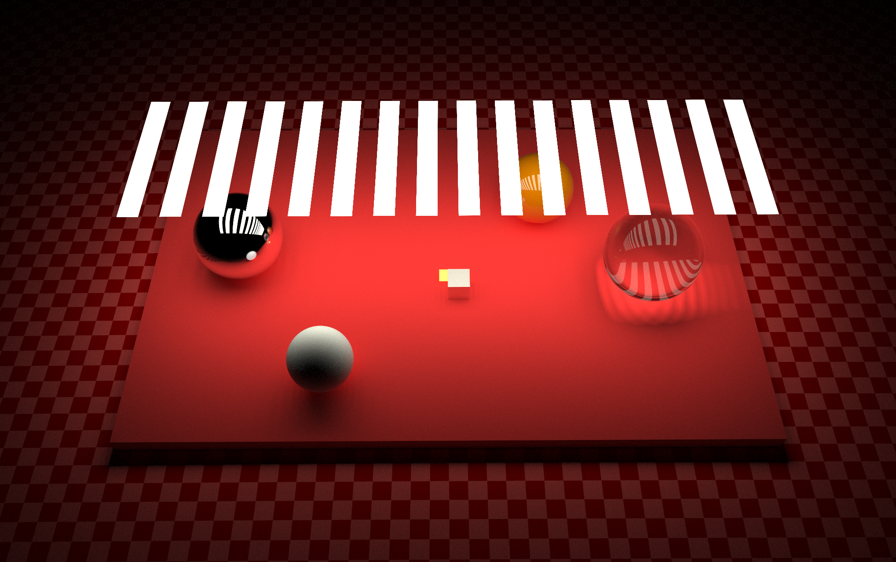
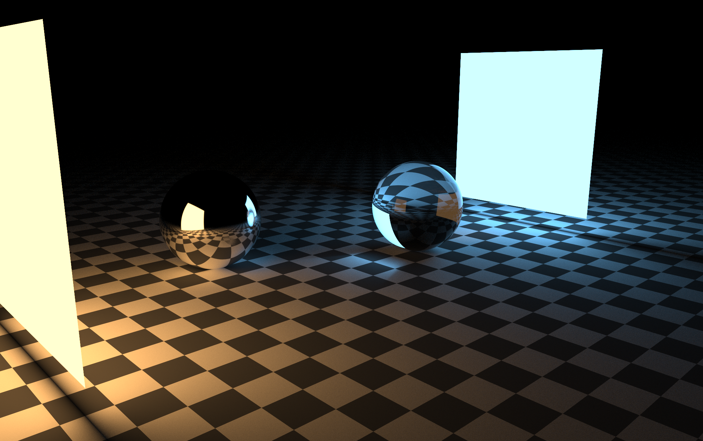
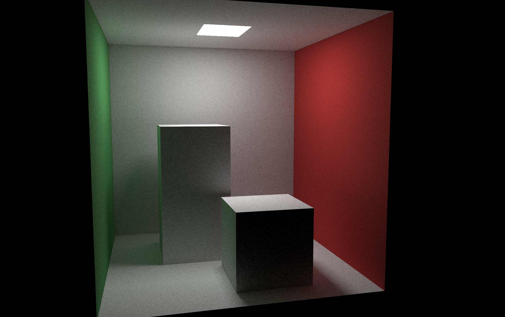

# GLSL Path Tracer

A Path Tracer written in GLSL.

Made this for fun too see how much faster raytracing is on the GPU (allot faster).

A lot of the code was just translated from my [Rust Path Tracer](https://github.com/nathanielfernandes/Rustacean-Tracing) to GLSL.

## Gallery

You can click an image to see it through a shader toy embed.

